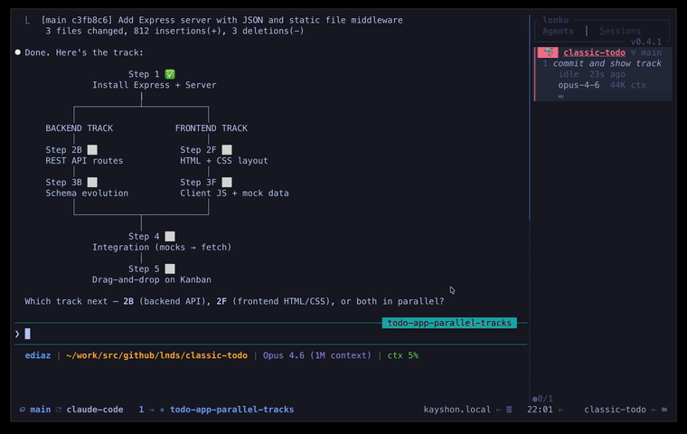

# Lonko

A TUI dashboard to monitor and control multiple [Claude Code](https://docs.anthropic.com/en/docs/claude-code) sessions running in tmux.



## About the name

**Lonko** (from Mapudungun, the language of the Mapuche people of southern Chile and Argentina) means *head* or *leader*. A lonko is the chief of a Mapuche community -- the one who oversees and coordinates. In the same spirit, this tool acts as the head of your Claude Code sessions: watching over them, keeping them organized, and letting you direct them from a single place.

## Features

- **Live session monitoring** -- see all running Claude Code agents at a glance with status, model, token usage, and current activity
- **Permission handling** -- respond to Claude's permission prompts (`y`/`w`/`n`) without leaving your current pane
- **Worktree management** -- create and destroy git worktrees directly from the UI
- **Quick navigation** -- jump between agents with keyboard shortcuts or digit keys (`1`-`9`)
- **tmux session view** -- browse and manage tmux sessions alongside your agents
- **Detail view** -- expand any session to see its full transcript
- **Search** -- filter agents by name or content
- **Help popup** -- press `?` for a quick keybinding reference

## Requirements

- [Rust](https://rustup.rs/) (for building)
- [tmux](https://github.com/tmux/tmux) (required at runtime)
- [Claude Code](https://docs.anthropic.com/en/docs/claude-code) CLI

## Installation

```sh
git clone https://github.com/lnds/lonko.git
cd lonko
./install.sh
```

The install script handles:

1. Building and installing `lonko` and `lonko-hook` via `cargo install`
2. Copying tmux helper scripts to `~/.config/tmux/scripts/`
3. Generating `~/.config/tmux/lonko.conf` with keybindings and hooks
4. Configuring Claude Code hooks in `~/.claude/settings.json`

Then add one line to your `tmux.conf`:

```tmux
if-shell "[ -f ~/.config/tmux/lonko.conf ]" "source-file ~/.config/tmux/lonko.conf"
```

## Usage

Toggle the lonko panel with `prefix + s` in tmux.

### Keybindings

| Key | Action |
|-----|--------|
| `j`/`k` or arrows | Navigate sessions |
| `Tab` | Switch between Agents and Sessions tabs |
| `Enter` | Focus selected session |
| `1`-`9` | Jump to nth session |
| `d` | Toggle detail view |
| `/` | Search |
| `g` | Create worktree |
| `x` | Kill agent and remove worktree |
| `X` | Soft kill (Ctrl-C) |
| `y`/`w`/`n` | Respond to permission prompts |
| `?` | Help |
| `q` | Hide panel |

### Terminal integration

For direct keybindings from any pane (without focusing the panel), configure your terminal to send escape sequences. Example for Ghostty:

```
keybind = cmd+shift+a=text:\x1b[sa   # Open Agents tab
keybind = cmd+shift+s=text:\x1b[ss   # Open Sessions tab
keybind = cmd+shift+y=text:\x1b[sy   # Respond yes
keybind = cmd+shift+n=text:\x1b[sn   # Respond no
keybind = cmd+shift+w=text:\x1b[sw   # Respond always
```

This works with any terminal that supports custom escape sequences (Ghostty, WezTerm, Kitty, etc.).

## Architecture

Lonko discovers sessions through three independent paths:

- **Hook events** -- Claude Code fires lifecycle hooks that `lonko-hook` forwards via Unix socket (fastest path)
- **Filesystem watcher** -- monitors `~/.claude/sessions/` for new session files
- **tmux scanner** -- periodic scan of tmux panes for Claude processes

See [ARCHITECTURE.md](ARCHITECTURE.md) for the full design.

## License

MIT
